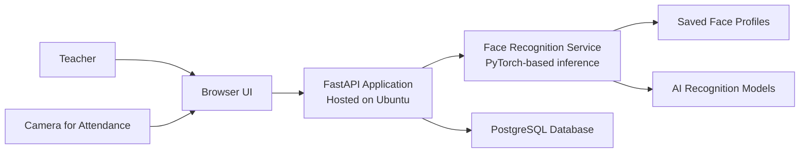

# Simple Application Topology

This version is simplified for presentation and focuses on the main system parts and how data flows between them.

## Presentation Diagram

## What To Say

- The teacher interacts with the system through the browser UI.
- A separate camera input is used for attendance capture.
- The browser sends requests to the FastAPI application.
- The FastAPI application is hosted on Ubuntu.
- FastAPI handles normal data through PostgreSQL.
- Face-related requests are sent to the face recognition service.
- The face recognition service uses PyTorch-based models, saved face profiles, and AI recognition models.
