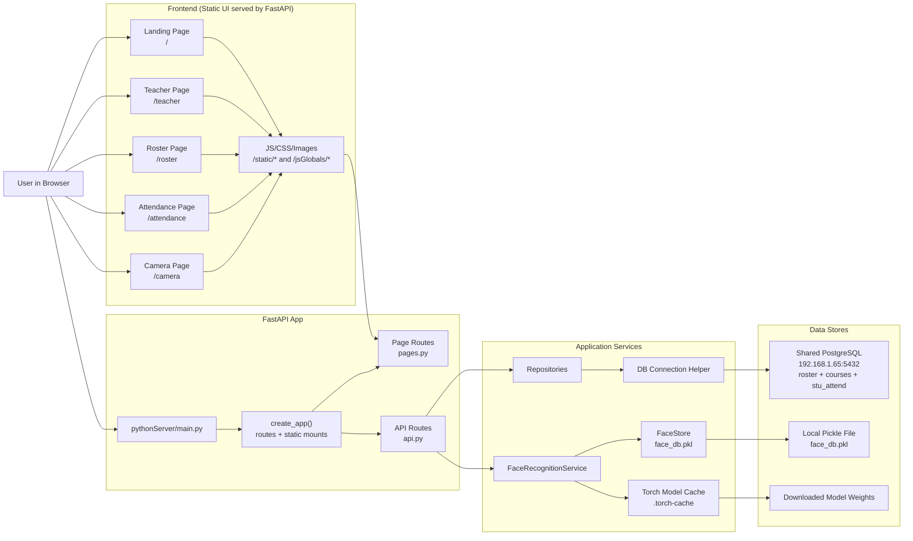
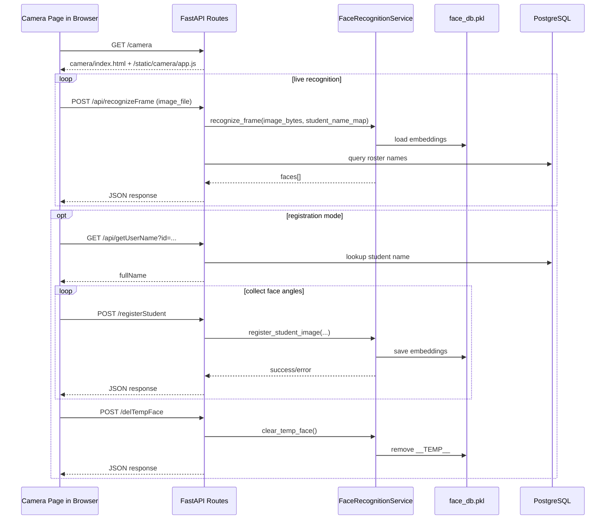

# Application Topology

This diagram shows how the browser UI, FastAPI backend, PostgreSQL database, and local face-recognition storage work together in `dev-attend2`.

## High-Level Topology

## Camera And Registration Flow

## Responsibilities By Layer

- Browser UI: renders pages, captures webcam frames, sends `fetch()` requests, and updates attendance/registration state in the user interface.
- FastAPI page routes: serve the HTML entry points for the landing, teacher, roster, attendance, and camera pages.
- FastAPI API routes: handle roster lookups, student creation, attendance queries, frame recognition, face registration, and temp-face cleanup.
- Repository layer: isolates SQL queries for roster and attendance data.
- FaceRecognitionService: loads models, detects faces, creates embeddings, compares embeddings, and returns recognition results.
- FaceStore: persists face embeddings to the local `face_db.pkl` file.
- PostgreSQL: stores student roster data, courses, and attendance records on the shared `192.168.1.65` database.
- `.torch-cache`: stores downloaded ML model weights used by `facenet-pytorch`.

## Current Network Setup

- The active database host is `192.168.1.65`.
- This development computer is configured as `192.168.1.66/24` so it can reach the database.
- Uvicorn is run on `0.0.0.0:8001`; use `http://127.0.0.1:8001` from this computer.
- The camera page should be opened from localhost when testing on this computer so browser camera permissions work reliably.

## Shared Database Compatibility

The shared database schema is not identical to every local schema this project has used.
The current code accounts for these differences:

- `roster` may contain only `stuid`, `fname`, `lname`, and `email`, with no class-assignment column.
- `stu_attend` may contain `attend_timestamp`; the app adds and backfills `timestamp` when needed.
- Auto-absence marking skips when the roster has no class-assignment column.

## Short Narrative

1. A browser requests a page such as `/camera` or `/roster`.
2. FastAPI returns the page plus its static JavaScript, CSS, and shared assets.
3. Frontend JavaScript calls API routes for data or camera processing.
4. Data-oriented routes query PostgreSQL through repository functions.
5. Face-oriented routes call `FaceRecognitionService`, which uses local model files and the local face embedding store.
6. Results are returned as JSON for the browser to render.
